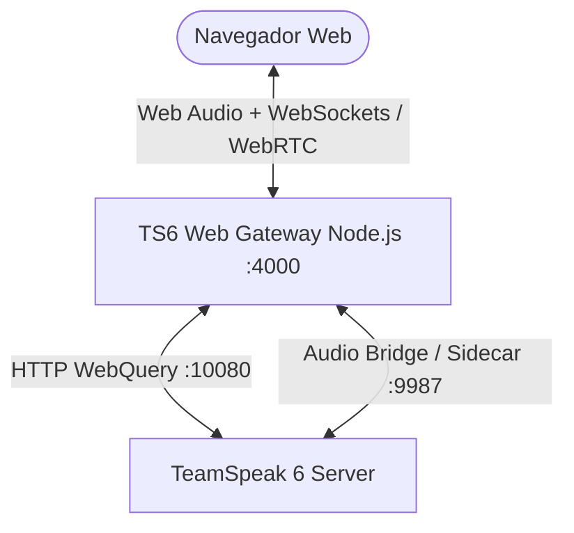

# 🎙️ TeamSpeak 6 Web Client — Proof of Concept (PoC)

Uma aplicação web completa e moderna que conecta ao servidor **TeamSpeak 6**, permitindo **falar pelo navegador**, **ouvir em tempo real**, **trocar de canais** e **entrar/sair** sem necessidade de instalar o cliente nativo no computador.

---

## 🚀 Funcionalidades

- 🎙️ **Voz em Tempo Real:** Captura de microfone com processamento PCM 48kHz, cancelamento de eco e supressão de ruído nativos do navegador.
- ⚡ **Modos de Transmissão:**
  - **Ativação por Voz (VAD)** com medidor VU em tempo real.
  - **Push-To-Talk (PTT)** via barra de espaço (`Space`) ou botão segurar para falar.
- 🔄 **Navegação em Canais:** Árvore de canais sincronizada com a API **WebQuery HTTP** (`:10080`) do TeamSpeak 6.
- 👥 **Indicador de Quem Está Falando:** Avatares com brilho dinâmico (*talking glow effect*) e status de microfone/áudio.
- 🔌 **Conectar e Desconectar:** Controle total de sessão, nickname e seleção de sala inicial.
- 🐳 **Pronto para Docker & GitHub:** Configurado com Dockerfile multi-stage e Docker Compose.

---

## 📐 Arquitetura



1. **Frontend (Vite + React + TailwindCSS):** Interface responsiva, captura de áudio via Web Audio API e gerenciamento de estado via WebSockets.
2. **Backend Gateway (Node.js + Express + WS):** Roteador de pacotes de áudio entre salas, integração com a API WebQuery do TS6 para lista de canais e movimentação de clientes.

---

## 📂 Estrutura do Repositório

```text
poc-ts6-webclient/
├── backend/                # Gateway Node.js (WebSockets + WebQuery TS6)
│   ├── src/
│   │   ├── config.ts       # Configurações do ambiente
│   │   ├── server.ts       # Servidor HTTP e WebSocket
│   │   └── ts6/
│   │       ├── audioBridge.ts # Roteamento de áudio por canal
│   │       └── webquery.ts    # Comunicação com a API do TS6
│   ├── Dockerfile
│   └── package.json
├── frontend/               # Interface Web (React + TypeScript)
│   ├── src/
│   │   ├── components/     # Componentes visuais (Header, Canais, Voz, etc.)
│   │   ├── hooks/          # Hooks customizados (useVoiceAudio, useTS6Client)
│   │   ├── types/          # Tipagens TypeScript
│   │   └── App.tsx
│   ├── Dockerfile
│   └── package.json
├── docker-compose.yml      # Orquestração dos containers
├── .env.example            # Variáveis de ambiente de exemplo
└── README.md
```

---

## 🛠️ Como Executar Localmente

### Pré-requisitos
- Node.js 18+ ou Docker & Docker Compose
- Servidor TeamSpeak 6 em execução

### Opção 1: Rodando com Docker Compose (Mais Rápido)

```bash
# 1. Clone o repositório
git clone https://github.com/SEU_USUARIO/teamspeak6-webclient-poc.git
cd teamspeak6-webclient-poc

# 2. Inicie os containers
docker-compose up -d --build
```
- Acesse o Frontend em: **http://localhost:8080** (ou `http://IP_DA_VPS:8080`)
- Gateway Backend em: **http://localhost:4000**

---

### Opção 2: Rodando em Modo Desenvolvimento

#### 1. Iniciar o Backend:
```bash
cd backend
npm install
npm run dev
```

#### 2. Iniciar o Frontend:
```bash
cd frontend
npm install
npm run dev
```
- Acesse: **http://localhost:5173**

---

## ⚙️ Variáveis de Ambiente (.env)

Crie um arquivo `.env` na raiz ou no backend baseado em `.env.example`:

```env
PORT=4000
TS6_HOST=seu_servidor_ts6.com
TS6_VOICE_HOST=seu_servidor_ts6.com
TS6_VOICE_PORT=9987
TS6_SERVER_ID=1
TS6_API_KEY=sua_chave_api_aqui
CORS_ORIGIN=*
```

---

## 📦 Como Publicar no GitHub

```bash
cd poc-ts6-webclient
git init
git add .
git commit -m "feat: initial commit - TS6 Web Client PoC"
git branch -M main
git remote add origin https://github.com/eduardo-nedel/poc-teamspeak-6-web-client.git
git push -u origin main
```

---

## 📜 Licença

Distribuído sob a licença MIT. Sinta-se livre para usar, estudar e evoluir.
